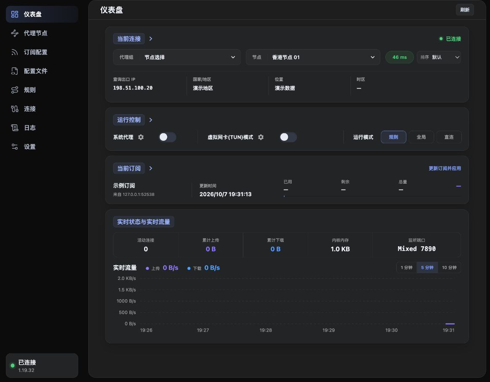
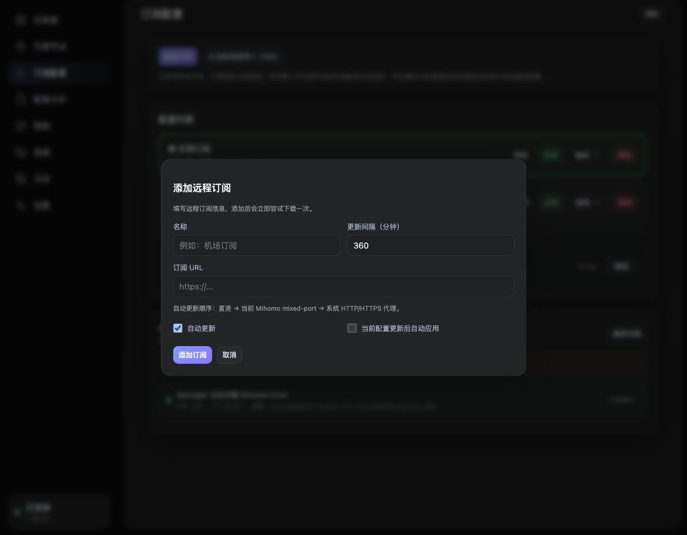
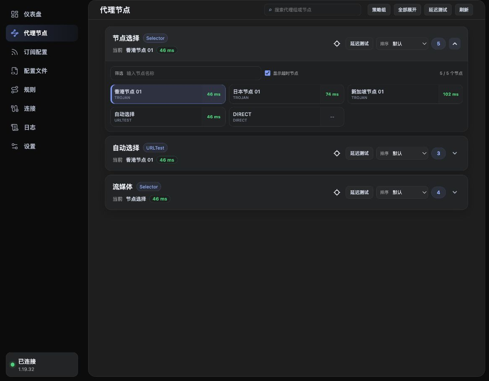
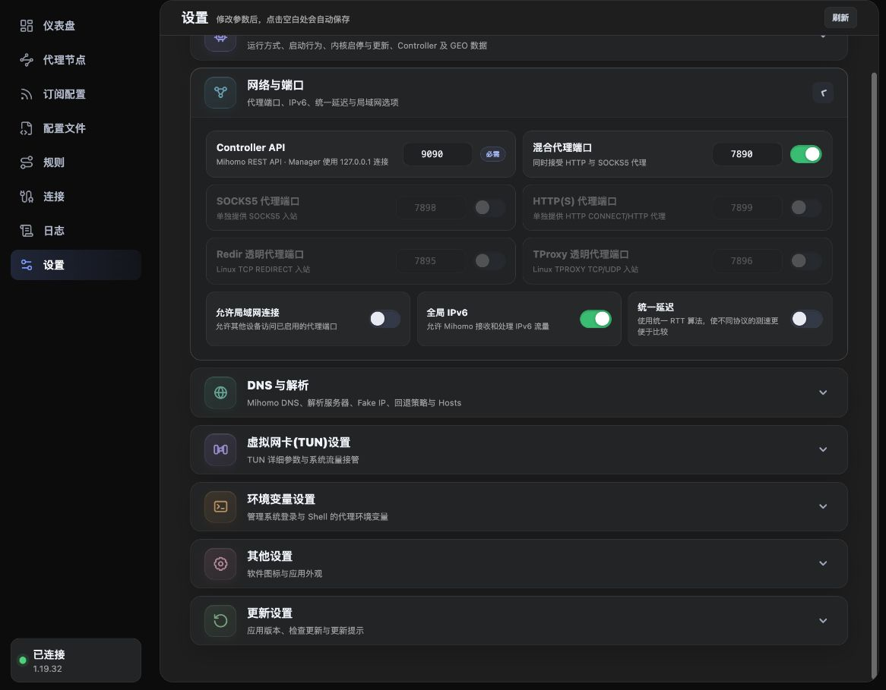
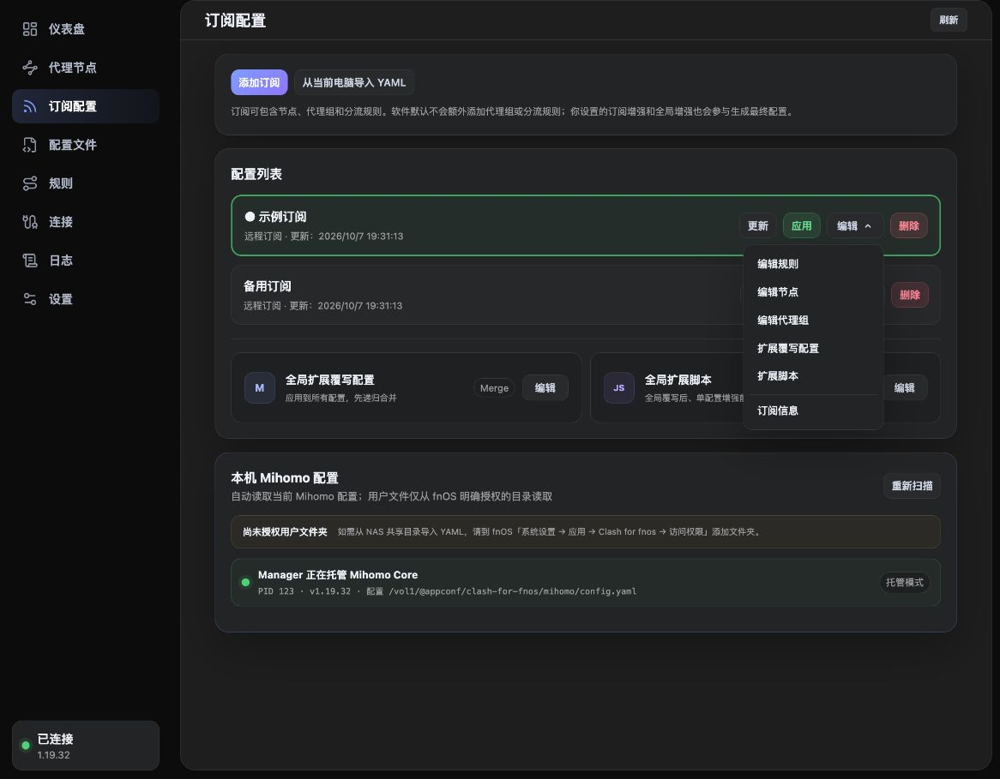
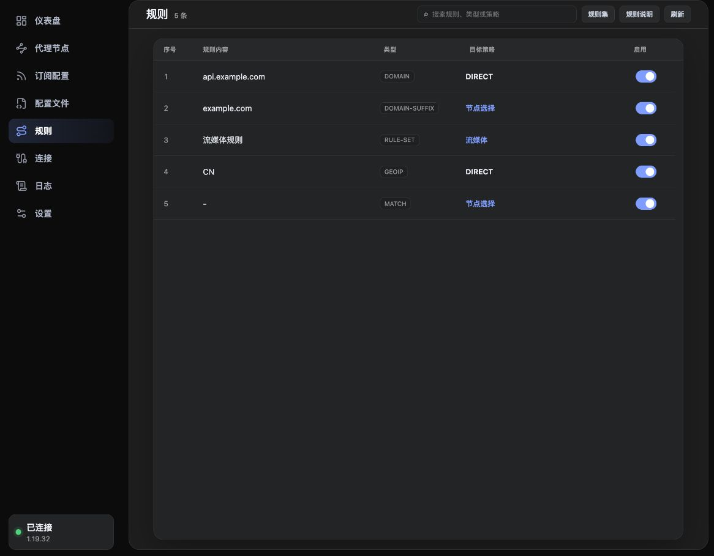
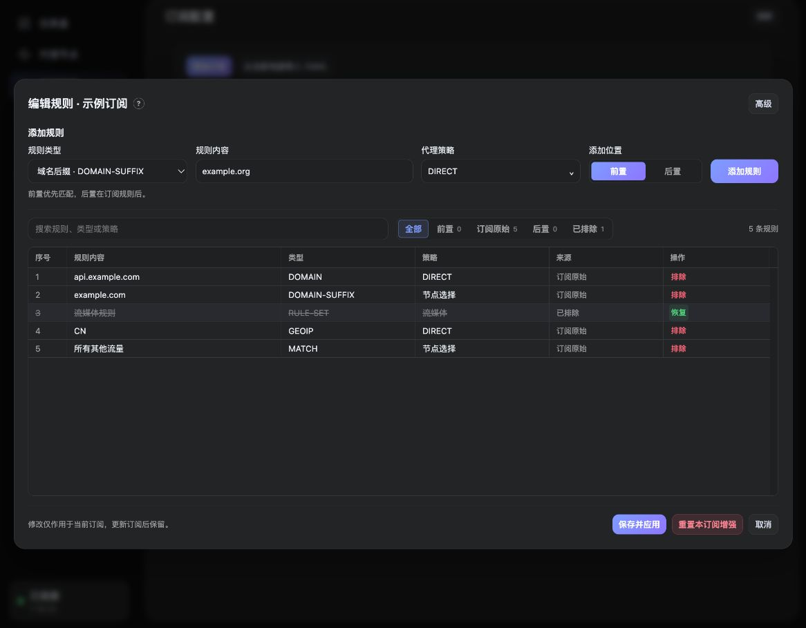
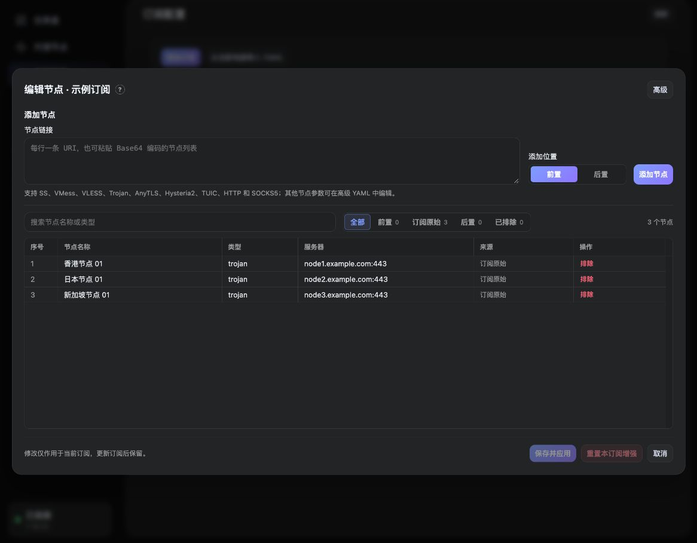
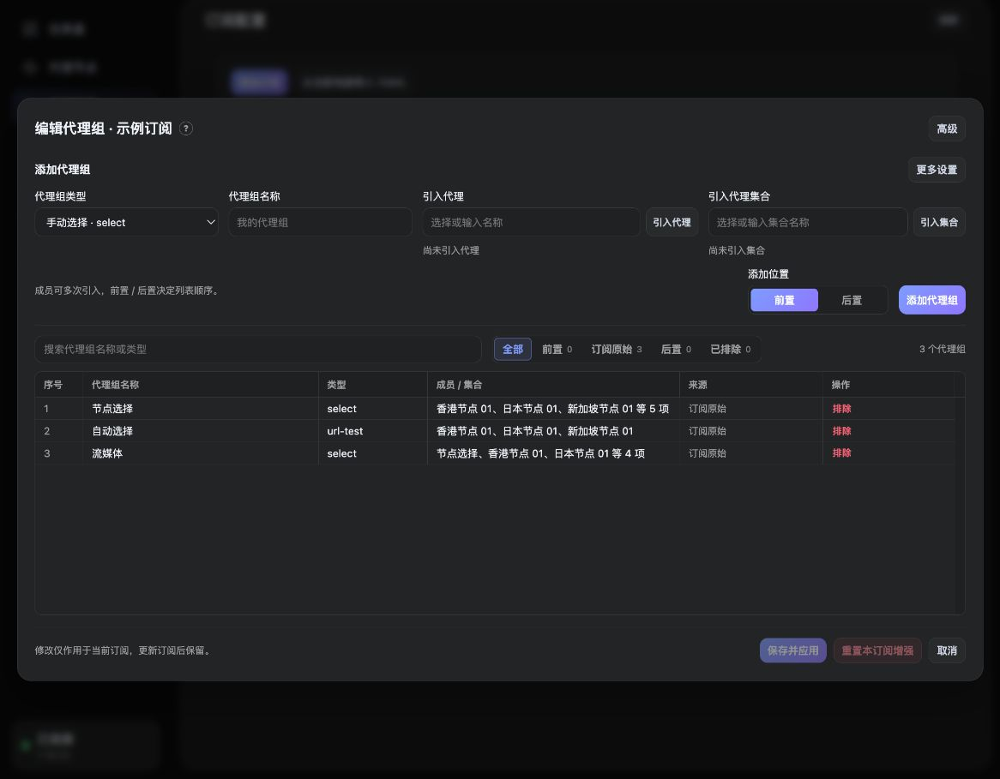
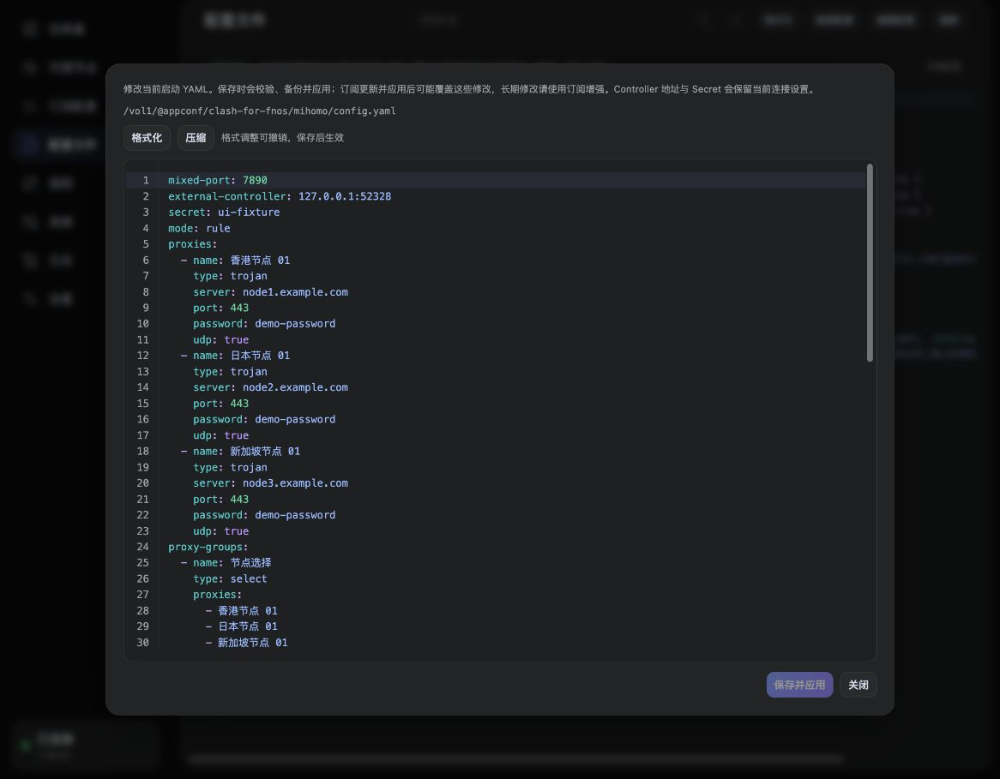

# Clash for fnos 操作手册

适用版本：**v1.3.0** · 更新日期：**2026 年 10 月 7 日**。

首次使用按第 1～3 章操作；日常修改可从目录直接找到对应功能。软件负责管理 Mihomo 内核，订阅和节点需自行准备。

截图来自本软件的实际界面，使用演示数据；图中的订阅、地址、密码和测速结果仅用于说明。界面颜色跟随 fnOS 主题。

## 目录

- [1 安装与打开](#1-安装与打开)
- [2 首次使用](#2-首次使用)
- [3 让程序使用代理](#3-让程序使用代理)
- [4 管理订阅](#4-管理订阅)
- [5 查看与修改规则](#5-查看与修改规则)
- [6 编辑节点与代理组](#6-编辑节点与代理组)
- [7 扩展覆写与脚本](#7-扩展覆写与脚本)
- [8 查看与编辑配置文件](#8-查看与编辑配置文件)
- [9 设置速查](#9-设置速查)
- [10 连接与日志](#10-连接与日志)
- [11 升级与备份](#11-升级与备份)
- [12 常见问题](#12-常见问题)

## 1 安装与打开

### 选择安装包

需要 **fnOS 1.1.3100 或更高版本**、应用安装权限，以及可用的 Clash／Mihomo YAML 订阅或配置文件。

在 [项目 Releases](https://github.com/chenpingonline/Clash-for-fnos/releases) 下载 FPK：

| 安装包 | 适用设备 | Mihomo 内核 |
| --- | --- | --- |
| x86_64 | x86_64 NAS | 内置对应架构的 v1.19.32 |
| arm64 | ARM64 NAS | 内置对应架构的 v1.19.32 |
| all | 上述两种架构 | 首次启用时在线下载；升级保留已有内核 |

优先选设备对应的架构包。all 包首次启用需要 NAS 能下载内核；不支持 32 位 x86 或 ARMv7。

### 安装步骤

**路径：fnOS → 应用中心 → 手动安装**

1. 选择 FPK，按向导完成安装。
2. 从 fnOS 桌面打开 **Clash for fnos**。
3. 等待内核准备完成，再导入订阅。

默认使用 **Manager 托管**。all 包下载失败时，按仪表盘提示重试，也可从官方地址下载对应架构的 Core `.gz` 文件并上传。



*图 1：仪表盘用于查看当前节点、切换运行模式和确认内核状态。左下角“已连接”表示软件已连接内核。*

## 2 首次使用

### 第一步：添加并应用配置

**路径：订阅配置 → 添加订阅**

1. 填写名称和完整的 **订阅 URL**。
2. 按需保留“自动更新”，点击 **添加订阅**，等待下载完成。
3. 在新订阅卡片上点击 **应用**。



*图 2：添加时会下载一次；添加完成后还需在卡片上点击“应用”。*

使用电脑上的文件时，走 **订阅配置 → 从当前电脑导入 YAML**，导入后同样点击 **应用**。

**生效结果：**当前配置显示绿色边框和名称前的圆点，“代理节点”页出现配置中的代理组和节点。

### 第二步：选择节点

**路径：代理节点 → 展开手动选择组 → 延迟测试 → 点击节点名称**

1. 展开手动选择组，通常标为 `Selector`。
2. 点击本组 **延迟测试**，再点击要使用的节点名称。
3. 确认组内“当前”节点已更新。
4. 到 **仪表盘 → 运行模式**，选择 **规则**。



*图 3：点击节点名称切换；点击延迟值只测试该节点。自动选择组由内核按配置选择成员。*

测速超时不一定表示节点完全不可用，延迟也不等于下载速度。可换节点或测试地址后再验证。

### 第三步：接入并验证

按下一章为目标程序设置代理，再发起一次请求，到 **连接** 页核对目标、匹配规则和代理链。

**“已连接”不代表 NAS、电脑或整个局域网已经使用代理。**

### 页面速查

| 左侧菜单 | 主要用途 |
| --- | --- |
| 仪表盘 | 当前节点、运行模式、系统代理、TUN 和流量 |
| 代理节点 | 选择节点、测速、排序与筛选 |
| 订阅配置 | 导入、更新、切换订阅及编辑增强 |
| 配置文件 | 查看和编辑当前启动 YAML |
| 规则 | 查看生效规则、开关规则、更新规则集 |
| 连接 | 查看请求去向、关闭连接 |
| 日志 | 查看和筛选 Mihomo 日志 |
| 设置 | 内核、端口、DNS、TUN 和应用更新 |

## 3 让程序使用代理

先确认订阅和节点可用，再按使用对象选择接入方式。

| 使用对象 | 菜单路径与操作 |
| --- | --- |
| NAS 上读取代理环境变量的程序 | **仪表盘 → 系统代理**；开启后按需重启程序或重新登录 Shell |
| 需要透明接管的 NAS 流量 | **仪表盘 → 虚拟网卡(TUN)模式**；详细参数在 **设置 → 虚拟网卡(TUN)设置** |
| 电脑、手机等局域网设备 | **设置 → 网络与端口 → 允许局域网连接**；在设备或程序中填写 NAS IP 和实际代理端口 |
| Docker 容器 | 在容器或应用中配置可访问的 NAS 代理地址；是否可达取决于容器网络 |

### 局域网设备接入示例

**路径：设置 → 网络与端口**

1. 确认“混合代理端口”已启用，记录端口号。
2. 开启 **允许局域网连接**，等待保存完成。
3. 在客户端填写 NAS 的局域网 IP 和该端口。

例如 NAS 是 `192.168.1.10`、混合端口是 `7890`，代理服务器填 `192.168.1.10`，端口填 `7890`。请使用自己的值；`127.0.0.1` 指向客户端自身，不能代替 NAS IP。



*图 4：混合端口同时接受 HTTP 与 SOCKS5 代理。Controller API 是管理端口，不是客户端的代理端口。*

### 系统代理与 TUN 的使用范围

- **系统代理**管理 fnOS 的代理环境变量，不会自动设置打开网页的电脑。已有进程、Docker 和不读取变量的服务可能不生效；齿轮按钮可调整端口、绕过地址和写入范围。
- **TUN**会改变 NAS 的路由与 DNS 流向，不能保证接管所有容器或整个局域网。首次使用保留默认参数；同时使用 VPN 等网络时，在 TUN 设置中按需填写排除网段。网络异常时先关闭 TUN，再排查 DNS 和路由。

代理端口仅向需要使用的网络开放，不要直接暴露到公网。

### 运行模式

**路径：仪表盘 → 运行模式**

| 模式 | 进入内核的请求如何处理 |
| --- | --- |
| 规则 | 按配置中的规则分流，日常推荐 |
| 全局 | 使用全局策略选择的代理 |
| 直连 | 直接连接目标 |

切换模式只影响已经进入内核的流量，不会替目标程序完成代理接入。

## 4 管理订阅

**路径：订阅配置 → 对应订阅卡片**



*图 5：“编辑”菜单管理这一份订阅；下方的全局扩展用于所有配置。*

| 按钮或菜单 | 用途 |
| --- | --- |
| 更新 | 重新下载内容；是否立即生效取决于当前配置的自动应用选项 |
| 应用 | 合并增强与设置，校验后加载；也是切换订阅的入口 |
| 编辑 → 订阅信息 | 修改名称、URL、更新间隔和自动更新选项 |
| 编辑 → 编辑规则／节点／代理组 | 保存长期增删与排序修改 |
| 编辑 → 扩展覆写配置／扩展脚本 | 覆盖字段或按条件修改配置 |
| 删除 | 删除该配置及其增强；先保存需要保留的内容 |

**刷新**仅重新读取页面数据，**更新**才下载订阅。流量与到期信息由订阅提供，没有显示不代表订阅无效。

### 自动更新

**路径：订阅配置 → 对应订阅的编辑 → 订阅信息**

1. 勾选 **自动更新**，设置间隔，最小为 **5 分钟**。
2. 需要当前订阅更新后立即生效时，勾选 **当前配置更新后自动应用**。
3. 点击 **保存修改**。修改 URL 后，再点卡片上的 **更新**。

自动应用只针对当前配置，不会因其他订阅更新而自动切换。下载失败时，查看卡片的“最近下载”和错误提示；下载在 NAS 执行，电脑能打开链接不代表 NAS 一定能下载。

### 从 NAS 导入 YAML

**路径：订阅配置 → 本机 Mihomo 配置 → 重新扫描 → 导入／导入并应用**

读取用户文件夹前，在 fnOS **系统设置 → 应用 → Clash for fnos → 访问权限**授权目录，然后重新扫描。“从当前电脑导入”读取的是打开网页的设备，与 NAS 文件入口不同。

## 5 查看与修改规则

### 开关已有规则

**路径：规则 → 搜索目标规则 → 启用开关**



*图 6：关闭开关会跳过这一条规则，请求继续匹配后续规则，不会自动改为直连。*

核对内容和策略后关闭开关，灰色删除线表示禁用；重新开启即可恢复。状态按订阅独立保存，更新订阅、重载配置和重启后会匹配恢复。规则内容、目标策略或重复数量变化时可能无法匹配，需要重新设置。

关闭 `RULE-SET` 会跳过整个规则集引用；修改后用新请求验证。内核不支持开关时，操作不可用。

### 长期新增或排除规则

**路径：订阅配置 → 对应订阅的编辑 → 编辑规则**

例如让 `example.org` 及其子域名直连：

1. 类型选 **域名后缀 · DOMAIN-SUFFIX**，内容填 `example.org`。
2. 策略选 **DIRECT**，位置选 **前置**，点击 **添加规则**。
3. 核对列表，点击 **保存并应用**。



*图 7：红色“排除”跳过原始条目，绿色“恢复”撤销排除；需要保存后生效。*

可视化“规则内容”只填域名等匹配值。前置规则优先匹配；后置放在原始规则后，如果前面已有 `MATCH`，后置规则可能无法命中。

搜索和来源筛选可定位条目；自定义条目可编辑、排序或删除。**重置本订阅增强**清除此编辑器的增删记录，确认后仍需保存。标题旁 **?** 可查看示例。

**排除全部原始规则**一次排除当前订阅已下载的全部原始规则，不受搜索和来源筛选影响，保留自定义前置、后置规则。**恢复全部原始规则**撤销当前原始规则的排除。操作先修改草稿，点击 **保存并应用** 后生效；订阅更新后新增加或变更文本的规则仍会出现。排除原始 `MATCH` 后，如需兜底，请添加自己的 `MATCH` 规则。

<details>
<summary>高级 YAML 示例</summary>

**路径：编辑规则 → 高级**

```yaml
prepend:
  - DOMAIN-SUFFIX,example.org,DIRECT
append: []
delete:
  - DOMAIN,api.example.com,DIRECT
```

`prepend` 为前置，`append` 为后置；规则增强的 `delete` 必须填写原始规则全文，包括类型、内容和策略。

</details>

### 更新规则集

**路径：规则 → 规则集 → 更新／全部更新**

这里更新配置引用的 Rule Provider 资源，不是重新下载订阅。没有引用规则集时，列表为空。

## 6 编辑节点与代理组

### 添加或排除节点

**路径：订阅配置 → 对应订阅的编辑 → 编辑节点**

1. 按行粘贴节点 URI，或粘贴 Base64 节点列表。
2. 选择前置／后置，点击添加按钮。
3. 核对名称、类型和服务器，点击 **保存并应用**。



*图 8：需要填写完整协议参数时切换“高级”；标题旁“?”提供示例。*

新增节点会加入首个手动选择组。排除原始节点时，同时移除组内的直接引用。节点名称不能与已有节点、代理组或内置策略重复；高级 YAML 的 `delete` 填节点名称，不填 URI。

### 添加或排除代理组

**路径：订阅配置 → 对应订阅的编辑 → 编辑代理组**

1. 选择类型，填写唯一组名。
2. 选择已有节点或代理组，点击 **引入代理**；使用代理集合时点击 **引入集合**。
3. 按需展开 **更多设置**，填写测试地址、间隔等参数。
4. 选择前置／后置并添加，点击 **保存并应用**。



*图 9：新增组可在“代理节点”查看；要让流量使用它，还需在规则中将策略指向该组。*

| 类型 | 用途 |
| --- | --- |
| select | 手动选择成员 |
| url-test | 按测试结果自动选择 |
| fallback | 按顺序选择可用成员，故障时转移 |
| load-balance | 按配置分配到不同成员 |

引用必须存在，代理组不能引用自身。排除组后，应同时调整规则和其他组对它的引用，否则配置可能校验失败。

点击原始组或自定义组操作栏中的 **复制**，顶部添加表单会填入组类型、全部成员、代理集合和更多设置，并自动生成不冲突的副本名称。修改名称和参数后点击 **添加代理组**，最后 **保存并应用**。原组保持原样，未在表单中展示的 YAML 字段也会随副本保留。

规则、节点和代理组编辑器均用红色表示排除／删除，绿色表示恢复；改动先保存在草稿中。**保存并应用会启用正在编辑的订阅，可能切换当前配置。**

“代理节点”页的 **策略组** 按钮管理的是 **Proxy Providers 代理集合**，用于更新和健康检查，与“编辑代理组”不同。

## 7 扩展覆写与脚本

需要长期覆盖其他字段或按条件修改配置时使用。增强与原始订阅分开保存，更新订阅后继续参与生成。

| 修改范围 | 菜单路径 |
| --- | --- |
| 一份订阅的字段 | **订阅配置 → 对应订阅的编辑 → 扩展覆写配置** |
| 一份订阅的脚本 | **订阅配置 → 对应订阅的编辑 → 扩展脚本** |
| 所有配置 | **订阅配置 → 配置列表下方 → 全局扩展覆写配置／全局扩展脚本 → 编辑** |

覆写只填需要修改的 YAML 片段：对象递归合并，数组整体替换。新增几条规则应使用“编辑规则”，直接写 `rules:` 会替换整个列表。

<details>
<summary>展开覆写与脚本示例</summary>

覆写示例：

```yaml
tcp-concurrent: true
profile:
  store-selected: true
```

脚本示例：

```javascript
function main(config, profileName) {
  const rule = "DOMAIN-SUFFIX,example.org,DIRECT";
  config.rules = [rule, ...(config.rules || []).filter(item => item !== rule)];
  return config;
}
```

脚本必须定义 `main(config, profileName)` 并返回配置对象。不要使用 `module.exports` 或 `export default`；不提供浏览器或 Node.js API，执行上限为 5 秒。

生成顺序：原始订阅 → 规则／节点／代理组增强 → 全局覆写 → 全局脚本 → 订阅覆写 → 订阅脚本 → Core 用户设置及启用的 DNS／Hosts 覆盖 → 校验应用。后面的处理可以覆盖前面的结果。

</details>

标题旁 **?** 可查看对应示例。单订阅保存并应用会启用该订阅；全局保存并应用会重载当前配置，没有当前配置时只保存。提示“已保存，但应用失败”时，先修正增强再应用，保存的内容可能已经变更。

## 8 查看与编辑配置文件

### 查看、搜索和复制

**路径：配置文件**

页面显示当前启动 YAML、路径和 PID。顶部搜索框支持全文搜索，**Enter**跳到下一项，**Shift + Enter**跳到上一项，也可点击箭头。

- **格式化／压缩**：切换展开或紧凑显示；格式化时每条规则独占一行。选择保存在当前浏览器中，重新进入或刷新页面后沿用；存储不可用时仍可切换。
- **展开更多**：按需显示超长行的后续内容。
- **复制配置**：复制完整原文，折叠预览不会删减内容。
- **横向滚动条**：查看右侧被截断的内容。

### 修改当前 YAML

**路径：配置文件 → 编辑配置**（仅 Manager 托管模式可编辑）

1. 修改 YAML，按需点击 **格式化／压缩**。
2. 点击 **保存并应用**，等待校验结果。
3. 返回仪表盘或配置页确认状态。



*图 10：保存会备份、校验并应用，失败时回滚；订阅更新并应用后可能覆盖直接修改。*

Controller 地址和 Secret 保留当前连接设置。编辑期间若订阅或配置发生变化，保存会被拒绝：先复制草稿，再重新打开编辑器合并修改。退出时，有改动会出现软件内的放弃确认。

**需要长期保留的修改，应放在订阅增强、扩展覆写／脚本或对应设置中。**直接改 YAML 不会自动登记为设置页的用户偏好。外部 Core 配置保持只读。

## 9 设置速查

**路径：设置 → 展开对应分类**

多数参数修改后，点击空白处自动保存；页面出现 **应用／保存设置** 按钮时，需点击按钮。等待结果提示后再继续操作。

| 要做什么 | 菜单路径 | 操作要点 |
| --- | --- | --- |
| 启停、重启或更新内核 | **Mihomo Core 设置 → 内核管理** | 停止或重启会中断代理；管理页面仍可使用 |
| 切换托管／外部内核 | **Mihomo Core 设置 → 内核管理 → Core 运行方式 → 应用** | 托管由软件管理；外部 Core 由用户自行管理 |
| 核对外部 Controller 和 Secret | **Mihomo Core 设置 → 连接管理** | 使用管理 API 地址；按提示保存并测试连接 |
| 修改测速地址和超时 | **Mihomo Core 设置 → 延迟测试** | 超时或测试地址不可达时，可换地址重试 |
| 查看或更新 GEO 数据 | **Mihomo Core 设置 → GEO 数据** | 下载缺失资源或立即更新；自动更新周期需保存设置 |
| 修改代理端口和局域网访问 | **网络与端口** | 更改端口后同步客户端；Controller 不是代理端口 |
| 覆盖订阅 DNS | **DNS 与解析** | 启用覆盖后再设置；关闭覆盖使用配置中的 DNS |
| 修改 TUN 参数 | **虚拟网卡(TUN)设置** | 关闭时修改会先保存，开启时生效 |
| 管理代理环境变量 | **环境变量设置** | 设置端口、绕过地址和写入范围；主要对新进程生效 |
| 更换图标 | **其他设置** | 外观跟随 fnOS 主题 |
| 查看应用版本和更新 | **更新设置** | 下载 FPK 后由 fnOS 应用中心安装 |

托管模式下，再次启动应用会自动准备并启用内核。需要保留手动选中的成员时，在 **内核管理**启用 **重启 Core 后恢复策略组选择**，仅恢复仍然有效的成员。

DNS 子页分为基础设置、解析服务器、Fake IP 与域名策略、回退过滤、Hosts 映射。启用 TUN 的 DNS 劫持前，确认 Mihomo DNS 可用；全局 IPv6 与 IPv6 DNS 解析是不同设置。

## 10 连接与日志

### 查看请求去向

**路径：连接**

核对目标、规则和代理链。行末 **×** 关闭单个连接，**关闭全部**中断当前全部连接，程序可能自动重连。修改节点或规则后，用新连接验证；已有连接不一定立即换策略。

### 查看内核日志

**路径：日志 → 选择级别／输入关键词**

普通排查先用 `info`，需要细节时再用 `debug`。可调整行数和自动换行。

- **停止／继续**只暂停或恢复读取，不会停止内核。
- **清空**删除软件记录的历史日志，先保存需要保留的信息。
- 搜索范围是当前读取的最近日志。

### 应用打不开时查看启动日志

SSH 登录 NAS 后执行：

```bash
sudo tail -n 200 /var/apps/clash-for-fnos/var/clash-for-fnos.log
```

需要持续观察时使用 `tail -f`，再到 fnOS 应用中心重启应用；按 **Ctrl+C**结束。此文件记录 Web 服务与 Root Helper 启动情况，与应用内的 Mihomo 日志不同。

## 11 升级与备份

### 升级

**路径：设置 → 更新设置 → 检查更新 → 下载更新**

下载对应架构 FPK，在 fnOS **应用中心 → 手动安装**安装新版。升级后确认当前订阅、节点、内核和 TUN 状态。正常升级保留配置和数据，不要用卸载重装代替升级。

Mihomo 内核独立更新：**设置 → Mihomo Core 设置 → 内核管理 → 检查更新**。勾选“更新后重启内核”可立即生效，否则下次启动时生效；失败时按提示重试。

### 备份

v1.3.0 没有一键导出全部数据的入口。可通过 **配置文件 → 复制配置**保存当前 YAML，并另行复制增强、覆写及脚本，记录订阅和网络设置。

仅复制 YAML 不能还原全部订阅身份、增强和规则开关。需要完整备份时，可备份应用配置目录中的订阅与增强、设置和 `rule-state.json`；备份包含私密信息，应妥善保存。

## 12 常见问题

| 问题 | 先检查什么 |
| --- | --- |
| 页面打不开或空白 | fnOS 最低版本、应用运行状态和启动日志 |
| 内核未连接 | 仪表盘错误提示；托管检查内核启动，外部核对 Controller／Secret |
| 订阅更新失败 | URL 是否完整、NAS 网络和 DNS、卡片“最近下载”；确认返回 Clash／Mihomo YAML |
| 导入后没有节点 | 是否点了“应用”；配置是否含节点、代理组或代理集合。软件不会自动补齐完整分流配置 |
| 已连接但程序仍直连 | 程序是否接入代理、端口、局域网访问、运行模式及命中规则 |
| 端口冲突 | **设置 → 网络与端口**更换端口；同步客户端，或连接已有外部 Core |
| 更新订阅覆盖了修改 | 长期修改移到对应订阅增强、扩展覆写或脚本 |
| 规则禁用状态未恢复 | 是否同一份订阅，规则内容、策略或重复数量是否变化；稍后刷新确认 |
| 新规则不命中 | 是否保存应用，流量是否进入内核，前面是否已匹配；按需前置并用新请求验证 |
| 增强校验失败 | YAML 缩进、名称重复、引用缺失、规则全文、脚本返回值；按具体错误修正 |

各订阅的增强和规则开关分别保存。改名不会改变记录；删除后重新添加会产生新的订阅身份。

提交 [GitHub Issues](https://github.com/chenpingonline/Clash-for-fnos/issues) 时，提供应用／内核／fnOS 版本、设备架构、托管或外部模式、复现步骤和相关日志；涉及网络时补充 TUN、Docker、VPN 情况。遮盖订阅 URL、Secret 和节点密码。

项目资料：[README](../README.md) · [更新日志](../CHANGELOG.md) · [下载与发布](https://github.com/chenpingonline/Clash-for-fnos/releases)。
